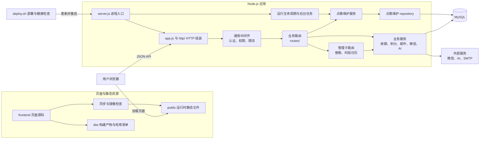

# 🏫 嘉二校园墙

嘉定二中校园墙平台，提供校园动态、评论互动、校园广播点歌、公众号推歌和管理后台。

> 这是公开脱敏镜像，仓库不包含生产私有 `.env`、上传媒体、用户数据库、日志、备份、服务器凭据或私有运维配置。请使用自己的本地配置和数据运行，不要把本镜像连接到任何生产服务。

## 项目仓库

- **GitHub**: https://github.com/Jay1023CN/school_wall
- **Gitee**: https://gitee.com/jay071023/campus_wall

## 技术栈

| 层次 | 技术 |
| --- | --- |
| 前端 | 原生 HTML、CSS、JavaScript |
| 服务端 | Node.js、Express |
| 数据库 | MySQL |
| 生产静态资源 | `public/` |
| 生产反向代理/静态目录 | Nginx（按部署环境配置） |

## 架构概览



`server.js` 管理环境加载、数据库初始化、监听、任务启停和进程退出。`app.js` 与 `http/` 独立组装 HTTP 应用；请求经过中间件进入 `routes/`，管理 API 继续检查登录、员工身份和具体权限。点歌自动维护已拆成模块组装、业务服务和 repository；其他业务按现有路由与服务边界维护。`app.js` 不监听端口、不初始化数据库，也不启动后台任务，便于 HTTP 层独立回归。

数据库初始化保留历史表的启动 DDL、字段补齐和索引检查，同时由 `config/schema-migrations.js` 通过 `schema_migrations` 记录新结构的版本化迁移。反馈写入使用 `services/write-transaction.js` 将业务行、幂等收据和管理员通知 outbox 放在同一事务中；通知 worker 对 SMTP 失败重试，语义是至少一次投递，SMTP 返回成功不等于邮件已进入收件箱。公众号同步使用数据库持久任务、owner 锁和租约，进程恢复后可继续未开始的任务；微信草稿外部调用结果未知时进入 `needs_review`，必须人工核对，系统不会自动重发。


前端以 `frontend/` 为唯一源码，使用 `npm run sync:frontend` 生成当前运行镜像 `public/`，再检查一致性。`npm run build` 同时生成带文件哈希清单的 `dist/`；生产仍使用现有部署目录。更多边界、生命周期和部署细节见[架构与维护说明](./docs/ARCHITECTURE.md)和[源码索引](./docs/PROJECT_INDEX.md)。

## 目录结构

```text
frontend/             页面源码、样式与浏览器脚本
public/               Express 实际提供的静态文件
routes/               HTTP 接口与权限边界
  admin.js            管理 API 入口
  admin/              管理后台子路由
services/             可复用业务能力
modules/              业务模块的依赖组装
repositories/         注入数据库连接的数据访问
http/                 中间件、静态页面和 API 挂载
jobs/                 后台任务启停与等待
middleware/           认证、权限等请求中间件
config/               数据库、版本化 schema 迁移、发布记录等非密钥配置
scripts/              测试、镜像、隐私与部署检查
docs/                 架构说明、维护文档与源码索引
server.js             进程启动与退出入口
app.js                HTTP 应用工厂
package.json          依赖和常用命令
deploy.sh             生产部署脚本
```

## 本地开发

需要 Node.js 和 MySQL。先在本地环境变量或私有配置中填写数据库及所需服务配置，再启动：

```bash
npm install
npm start
```

真实数据库凭据、API 密钥、部署密钥、上传文件和用户数据不要提交到仓库；本镜像只提供源码、占位配置和可公开的示例资源。

## 检查与测试

```bash
npm test
npm run sync:frontend
npm run check:mirrors
npm run build
npm run check:privacy
npm run check:deployment
```

`npm test` 运行项目回归检查；其他命令分别检查前后端静态镜像、敏感文件和部署脚本边界。

涉及持久任务和事务边界时，另运行 `node scripts/test-schema-migrations.js`、`node scripts/test-write-transaction.js`、`node scripts/test-notification-outbox.js`、`node scripts/test-mp-sync-jobs.js` 及相关内容事务专项检查；这些模拟检查不能替代真实 MySQL、微信公众号或 SMTP 验证。

## 部署与数据策略

生产环境的服务器地址、Webhook、日志路径和密钥只保存在私有运维配置中。部署流程、回滚条件和线上核验方式记录在[架构与维护说明](./docs/ARCHITECTURE.md)；Webhook 返回 `202` 只代表部署子进程已接受请求，必须继续查询部署状态确认提交号和健康检查结果。

帖子和点歌记录删除后默认在回收站保留 7 天，再由定时清理任务移除。
